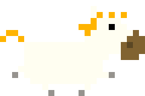
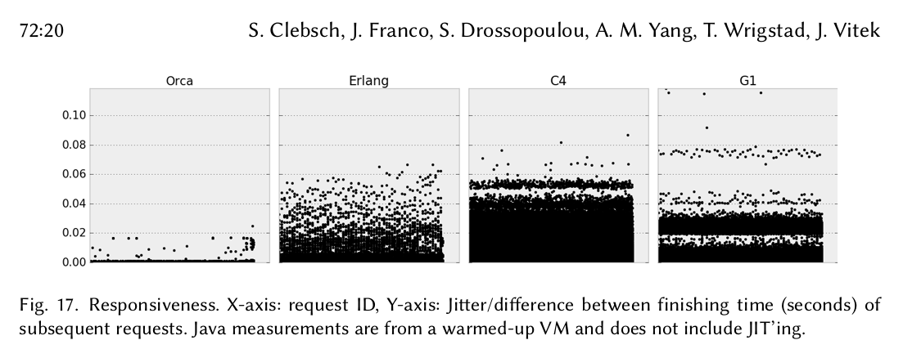
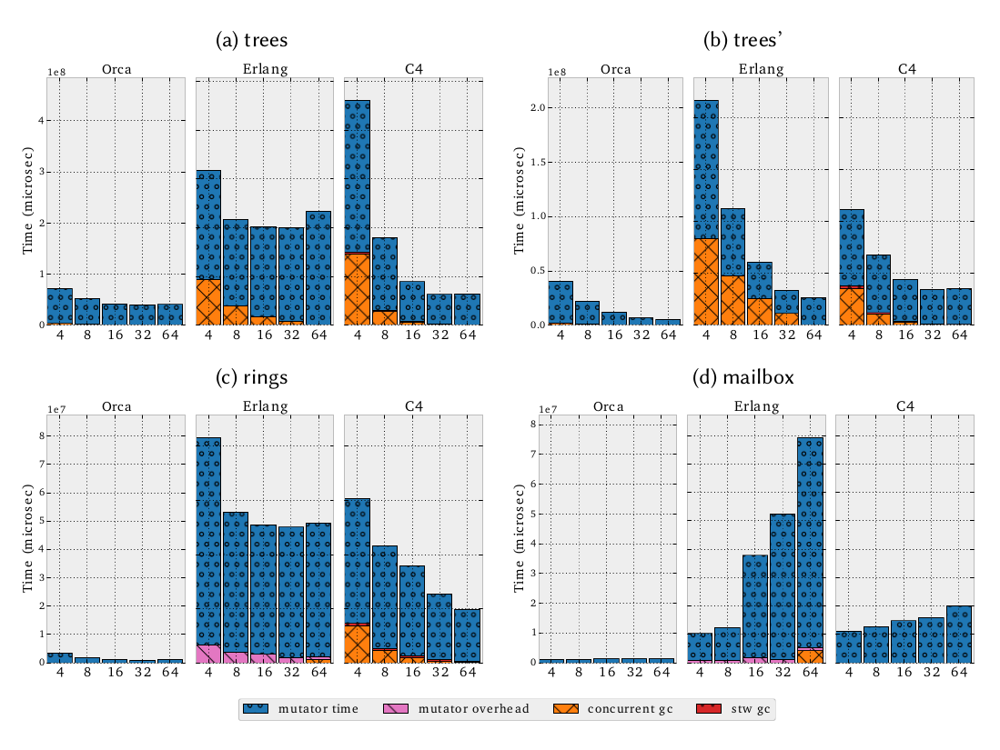
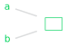
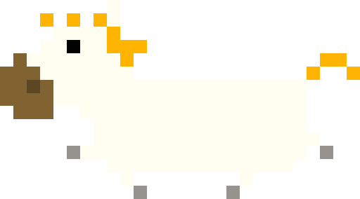

### EVERYONE GETS A
# PONY

<div class="namemail">
Kristoffer Gr&ouml;nlund<br>
<a href="mailto:kgronlund@suse.com">kgronlund@suse.com</a><br>
linux.conf.au 2018</div>

Note:

A talk about pony programming language. Me. I work for SUSE. HA architect.
Talk is not about anything I use for work. Reason: programming
language lover. Other reasons will become clear.

---

## PONY IS

> <strike>...a tiny horse</strike>

> ...an open-source, object-oriented, actor-model, capabilities-secure, high-performance programming language

Note:

Open source = BSD license. Community driven.
Actor model = erlang. High performance meaning native like rust or go.
Capabilities secure = key difference.

---

Sylvan Clebsch

Sophia Drossopoulou

Sean T Allen

Note:

Credits.
Sylvan = Author of pony. PhD at Imperial College London
Sophia = His supervising professor. Capabilities research.
Sean = current maintainer of pony. Was very helpful to me answering questions.

---

> Back in the flight sim days, when I would make my friends groan by telling them yet again about all the things I was going to do when I wrote a programming language, one of the people I would tell was Nathan Mehl. And one time, when I gave him yet another laundry list, he said: **“yeah, and I want a pony”**.

<small>&mdash; <a href="https://www.ponylang.org/blog/2017/05/an-early-history-of-pony/">Sylvan Clebsch</a></small>

---

## I AM NOT

* ...a pony
* ...in the pony core team
* ...using pony for work
* ...always correct

---

## AGENDA

1. Examples
2. Motivation
2. Reference capabilities
3. More examples
5. Demo

---

[playground.ponylang.org](https://playground.ponylang.org/)

---

``` pony
// My first pony program
actor Main
  new create(env: Env) =>
    env.out.print("Hello, linux.conf.au!")
```

---

```
mkdir helloworld
cd helloworld
vim main.pony
ponyc
./helloworld

```

---

``` pony
class Cat
  let name: String
  var _mood: I32 = 0

  new create(name': String) =>
    name = name'

  new moody(name': String, mood: I32) =>
    name = name'
    _mood = mood

  fun is_grumpy(): Bool => _mood < 0
```

---

``` pony
primitive Math
  fun double(a: I32): I32 => a * 2
  fun trouble(a: I32, b: I32): I32 => double(a) * double(b)
```

---

``` pony
primitive Happy fun apply(): I32 => 100
primitive Angry fun apply(): I32 => -100
```

---

``` pony
class Vec2
  var x: F32
  var y: F32

  new create(x': F32, y': F32) =>
    x = x'
    y = y'

  fun add(b: Vec2): Vec2 =>
    Vec2(x + b.x, y + b.y)

```

---

``` pony
actor Main
  new create(env: Env) =>
    let v1 = Vec2(1.0, 2.0)
    let v2 = Vec2(-2.0, -1.0)
    let v3 = v1 + v2
```

---

``` pony
primitive Red
primitive Green
primitive Blue

type Colour is (Red | Green | Blue)
```

---

``` pony
actor Main
  new create(env: Env) =>
    let colours: Array[Colour] = [Red; Red; Green; Blue]
    for colour in colours.values() do
      env.out.print(if colour is Green then "yes" else "no" end)
    end
```

---

``` pony
actor Main
  new create(env: Env) =>
    let things: Array[(Colour | U64)] = [Red; U64(3); Red; Green; U64(100)]
    for thing in things.values() do
      env.out.print(
        match thing
          | 100 => "one hundred"
          | let n: U64 => n.string()
          | Green => "yes"
          else "no"
        end)
    end
```

---

``` pony
trait Edible
  fun isitdelicious(): Bool => true

interface Poisonous
  fun deadly(): Bool

type QuestionableFoodChoice is (Edible & Poisonous)

```

---

``` pony
type Map[K: (Hashable box & Comparable[K] box), V] is HashMap[K, V, HashEq[K]]
```

---

<pre class="stretch">
<code data-trim class="lang-pony hljs">
use "collections"

interface CounterNotify
  be get_count(count: U32)

actor Main is CounterNotify
  let env: Env
  new create(env': Env) =>
    env = env'
    var counter = Counter
    for _ in Range[U32](0, 10) do
      counter.inc()
    end
    counter.get_and_reset(this)

  be get_count(count: U32) =>
    env.out.print(count.string())

actor Counter
  var _count: U32 = 0
  be inc() => _count = _count + 1
  be get_and_reset(notify: CounterNotify tag) =>
    notify.get_count(_count)
    _count = 0
</code>
</pre>

---

### Why pony?

---

* *Compiled* (native performance)
* *Correct* (compile time safety)
* *Actor model* (highly concurrent)

---

**get-stuff-done**

<small>
Correctness > Performance > Simplicity > Consistency > Completeness
</small>

---


* Type safe
* Memory safe
* Exception safe
* Data-race free
* Deadlock free

---

# ORCA

* Fully concurrent GC
* No *stop-the-world* phase
* Uses message passing

---



---



---

# Fast actors

* Zero copy messaging
* Fast to create
* 240 byte overhead per actor
* Actors are garbage collected

---

# Reference capabilities

---

**aliasing**



---

What does this alias imply about other aliases to the same data?

---

**Local aliases**: Other aliases in same actor (thread).

**Global aliases**: Aliases across actor boundaries.

---

**Sendable**: Can be passed to another actor.

---

# `val`

All aliases are read-only.

---

# `ref`

All aliases can read or write.

Data cannot be shared with other actors.

---

# `iso`

This is the only alias (read / write).

---

# `tag`

Alias which can't read *or* write.

Can be stored, compared and sent messages.

---

# `box`

This alias is read-only, but there may be local read/write aliases.

Alternatively, there may be global read-only aliases.

---

# `trn`

This alias is read/write, but there may be local `box` aliases.

Can be converted to a `val` alias (read only).

---

## consume & recover

---

``` pony
actor Main
  new create(env: Env) =>
    let a: String iso = "hello".clone() // only one alias
    let b = consume a                   // still only one alias!
    env.out.print(consume b)            // no aliases, can be sent
```

---

``` pony
actor Main
  new create(env: Env) =>
    let a = recover iso String(100) end // recover to iso from ref
    a.append("hello")                   // still writeable!
    env.out.print(consume a)            // consume iso to val
```

---

## Object capabilities

---

``` pony
primitive NetAuth
  new create(from: AmbientAuth) => None

primitive TCPAuth
  new create(from: (AmbientAuth | NetAuth)) => None

primitive TCPListenAuth
  new create(from: (AmbientAuth | NetAuth | TCPAuth)) => None
```

---

# Other features

---

<pre class="stretch">
<code data-trim class="lang-pony hljs">

// C FFI
use "lib:SDL2"
use @SDL_Init[I32](flags: U32)
use @SDL_CreateWindow[Pointer[_SDLWindow]](title: Pointer[U8] tag,
      x: I32, y: I32, w: I32, h: I32, flags: U32)
use @SDL_GetError[Pointer[U8]]()
use @SDL_Delay[None](ms: U32)

primitive _SDLWindow
primitive Video fun apply(): U32 => 0x20
primitive Shown fun apply(): U32 => 0x4

actor Main
  new create(env: Env) =>
    if @SDL_Init(Video()) != 0 then
      env.err.print(recover val String.copy_cstring(@SDL_GetError()) end)
      env.exitcode(1)
      return
    end
    let title = "Pony calling C".cstring()
    let win = @SDL_CreateWindow(title, -1, -1, 640, 480, Shown())
    @SDL_Delay(3000)

</code>
</pre>

---

<pre class="stretch">
<code data-trim class="lang-pony hljs">

// Generics (1 / 3)

class List[A]
  var _item: A
  var _next: (List[A] | None) = None

  new create(item: A) =>
    _item = consume item

  fun apply(): this->A =>
    _item

  fun next(): (this->List[A] | None) =>
    _next

  fun ref append(that: List[A]) =>
    if (_next is that) or (this is that) then
      return
    end
    that._next = _next
    _next = that

  fun values(): Values[A, this->List[A]]^ =>
    Values[A, this->List[A]](this)

</code>
</pre>

---

<pre class="stretch">
<code data-trim class="lang-pony hljs">

// Generics (2 / 3)

class Values[A, N: List[A] #read] is Iterator[N->A]
  var _next: (N | None)

  new create(head: (N | None)) =>
    _next = head

  fun has_next(): Bool =>
    _next isnt None

  fun ref next(): N->A ? =>
    match _next
    | let next': N =>
      _next = next'.next()
      next'()
    else
      error
    end

</code>
</pre>

---

``` pony

// Generics (3 / 3)

actor Main
  new create(env: Env) =>
    let l = List[String]("foo")
    l.append(List[String]("bar"))

    for item in l.values() do
      env.out.print(item)
    end

```

---

* Default and named arguments
* Error handling
* Lambdas and partial functions
* Bang and hat capabilities
* Viewpoint adaptation
* `stable`, the package manager
* ...

---



DEMO

[github.com/krig/tinyhorse](https://github.com/krig/tinyhorse)

---

# GET INVOLVED

[ponylang.org](https://ponylang.org)

[github.com/ponylang/ponyc](https://github.com/ponylang/ponyc)

`#ponylang @ freenode`

---


<div class="namemail"><a href="https://suse.com/careers">suse.com/careers</a></div>
